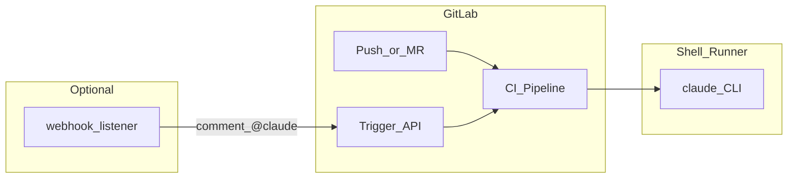

# gitlab-ai-ci-pipeline

GitLab CI templates and helpers for **AI code review** (Claude Code CLI) and optional **`@claude`** assist via webhook + pipeline trigger. Language and examples are **English**; no proprietary project data.

## What you get

| Feature | Trigger | Notes |
|---------|---------|-------|
| Level 1 review | Push to `feature/*` | Diff-based report; optional GitLab commit comment + Feishu |
| Level 2 review | MR targeting `integration/*` or `integration-*` | Full MR review |
| `@claude` assist | Comment on commit/MR | Requires webhook + trigger token |
| Memory bank update | Push to `integration/*` | Optional; updates `AI_REVIEW_MEMORY_BANK_DIR` |

**Requirements**: GitLab (SaaS or self-managed), **shell** runner, `claude` and `jq` on the runner, `ANTHROPIC_API_KEY` in CI variables. Feishu is optional.

## Architecture



## Quick start

1. Copy this repository into your app repo root (or copy `.gitlab-ci.yml`, `.gitlab/`, `.claude/skills/code-review-report/`).
2. In **Settings → CI/CD → Variables**, set at least:
   - `ANTHROPIC_API_KEY` (masked)
   - `GITLAB_API_TOKEN` (project token: `api`, `read_repository`, `write_repository` as needed)
   - `GITLAB_TRIGGER_TOKEN` if using `@claude`
3. Install **Claude Code CLI** on the runner; ensure `claude` is on `PATH`, or set `RUNNER_EXTRA_PATH` (e.g. `/opt/homebrew/bin` on macOS).
4. Optionally deploy `webhook/webhook-listener.py`, configure env from `webhook/.env.example`, add a GitLab webhook (Note events) and matching secret.
5. Optionally set `FEISHU_APP_TOKEN` for Feishu DMs.

See [docs/SETUP.md](docs/SETUP.md) for details.

## CI variables (template defaults)

| Variable | Purpose |
|----------|---------|
| `RUNNER_EXTRA_PATH` | Prepended to `PATH` if set |
| `AI_REVIEW_DOC_BASE` | Base dir for `{branch}-tech-doc.md` (default `docs/features`) |
| `AI_REVIEW_MR_SCOPE_HINT` | Overrides Level 2 scope line |
| `AI_REVIEW_MEMORY_BANK_DIR` | Directory for `update-memory-bank` job (default `memory-bank`) |

## Layout

```
.gitlab-ci.yml
.gitlab/send-feishu.py
.claude/skills/code-review-report/SKILL.md
webhook/webhook-listener.py
webhook/requirements.txt
webhook/.env.example
docs/SETUP.md
```

## License

MIT — see [LICENSE](LICENSE).

## Remote repository

After creating an empty project on GitLab/GitHub, see [docs/REMOTE.md](docs/REMOTE.md).
